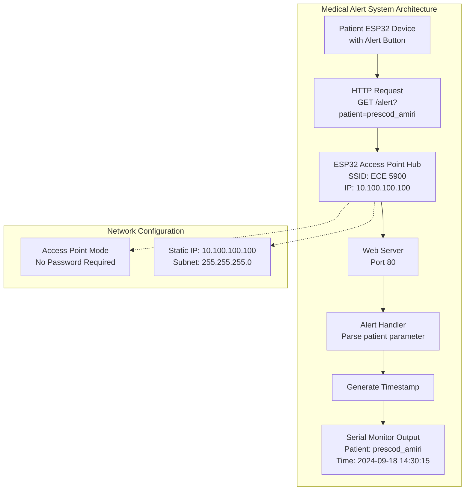

# Medical Alert System - ESP32 Implementation Plan

## Project Overview
Building a patient medical alert system using ESP32 as an access point hub that receives alerts from patient devices and logs them to the serial monitor.

## System Requirements
- **Access Point**: SSID "ECE 5900" (no password)
- **IP Address**: 10.100.100.100
- **API Endpoint**: `http://10.100.100.100/alert?patient=prescod_amiri`
- **Alert Handling**: Print patient name and timestamp to serial monitor
- **Client Devices**: Other ESP32 devices with physical alert buttons

## System Architecture



## Implementation Todo List

### Phase 1: Basic Network Setup
- [ ] Set up ESP32 WiFi Access Point with SSID "ECE 5900" (no password)
- [ ] Configure static IP address to 10.100.100.100
- [ ] Initialize HTTP web server on port 80

### Phase 2: Alert Handling
- [ ] Create `/alert` endpoint handler to parse patient parameter
- [ ] Implement alert logging with patient name and timestamp
- [ ] Add serial monitor output for received alerts

### Phase 3: Testing & Optimization
- [ ] Test the complete system with sample HTTP requests
- [ ] Add error handling for malformed requests
- [ ] Optimize memory usage and add basic security considerations

## Technical Components Required

### Libraries
- `WiFi.h` - ESP32 WiFi library for Access Point mode
- `WebServer.h` - ESP32WebServer for HTTP request handling
- `time.h` - For timestamp generation

### Key Functions to Implement
1. **WiFi Access Point Setup**
   - Configure AP mode with specified SSID
   - Set static IP configuration
   
2. **Web Server Initialization**
   - Start HTTP server on port 80
   - Define route handlers
   
3. **Alert Handler Function**
   - Parse URL parameters
   - Extract patient name
   - Generate timestamp
   - Format and print to serial

4. **Error Handling**
   - Handle missing patient parameter
   - Respond with appropriate HTTP status codes

## HTTP API Specification

### Alert Endpoint
- **URL**: `http://10.100.100.100/alert?patient={patient_name}`
- **Method**: GET
- **Parameters**: 
  - `patient` (required): Patient identifier/name
- **Response**: HTTP 200 OK with simple acknowledgment
- **Action**: Log alert to serial monitor with timestamp

### Example Request
```
GET /alert?patient=prescod_amiri HTTP/1.1
Host: 10.100.100.100
```

### Example Serial Output
```
[2024-09-18 14:30:15] ALERT: Patient prescod_amiri
[2024-09-18 14:32:42] ALERT: Patient johnson_mary
```

## Network Configuration Details
- **Mode**: Access Point (AP)
- **SSID**: "ECE 5900"
- **Password**: None (open network)
- **IP Address**: 10.100.100.100
- **Subnet Mask**: 255.255.255.0
- **Gateway**: 10.100.100.100 (self)

## Next Steps
1. Review and approve this implementation plan
2. Switch to Code mode to implement the ESP32 firmware
3. Test with simulated HTTP requests
4. Deploy and test with actual patient devices